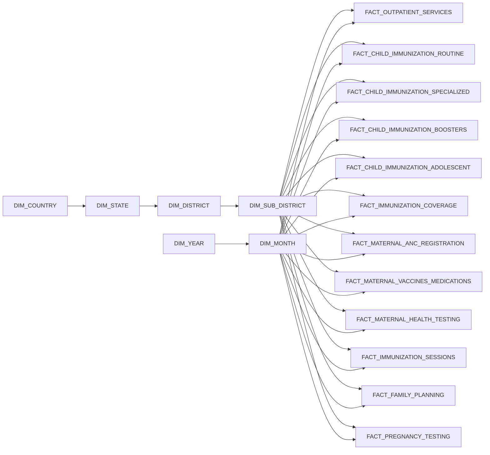

# Schema Diagram: INDIA_HMIS_Sub_District_Report_Rural_Urban (Readable)

## 1) Paper-Friendly High-Level View

## 2) Compact ER View (PK/FK only)

```mermaid
erDiagram
    DIM_COUNTRY ||--o{ DIM_STATE : COUNTRY_ID
    DIM_STATE ||--o{ DIM_DISTRICT : STATE_ID
    DIM_DISTRICT ||--o{ DIM_SUB_DISTRICT : DISTRICT_ID
    DIM_YEAR ||--o{ DIM_MONTH : YEAR_ID

    DIM_SUB_DISTRICT ||--o{ FACT_OUTPATIENT_SERVICES : SUB_DISTRICT_ID
    DIM_MONTH ||--o{ FACT_OUTPATIENT_SERVICES : MONTH_ID

    DIM_SUB_DISTRICT ||--o{ FACT_CHILD_IMMUNIZATION_ROUTINE : SUB_DISTRICT_ID
    DIM_MONTH ||--o{ FACT_CHILD_IMMUNIZATION_ROUTINE : MONTH_ID
    DIM_SUB_DISTRICT ||--o{ FACT_CHILD_IMMUNIZATION_SPECIALIZED : SUB_DISTRICT_ID
    DIM_MONTH ||--o{ FACT_CHILD_IMMUNIZATION_SPECIALIZED : MONTH_ID
    DIM_SUB_DISTRICT ||--o{ FACT_CHILD_IMMUNIZATION_BOOSTERS : SUB_DISTRICT_ID
    DIM_MONTH ||--o{ FACT_CHILD_IMMUNIZATION_BOOSTERS : MONTH_ID
    DIM_SUB_DISTRICT ||--o{ FACT_CHILD_IMMUNIZATION_ADOLESCENT : SUB_DISTRICT_ID
    DIM_MONTH ||--o{ FACT_CHILD_IMMUNIZATION_ADOLESCENT : MONTH_ID
    DIM_SUB_DISTRICT ||--o{ FACT_IMMUNIZATION_COVERAGE : SUB_DISTRICT_ID
    DIM_MONTH ||--o{ FACT_IMMUNIZATION_COVERAGE : MONTH_ID
    DIM_SUB_DISTRICT ||--o{ FACT_MATERNAL_ANC_REGISTRATION : SUB_DISTRICT_ID
    DIM_MONTH ||--o{ FACT_MATERNAL_ANC_REGISTRATION : MONTH_ID
    DIM_SUB_DISTRICT ||--o{ FACT_MATERNAL_VACCINES_MEDICATIONS : SUB_DISTRICT_ID
    DIM_MONTH ||--o{ FACT_MATERNAL_VACCINES_MEDICATIONS : MONTH_ID
    DIM_SUB_DISTRICT ||--o{ FACT_MATERNAL_HEALTH_TESTING : SUB_DISTRICT_ID
    DIM_MONTH ||--o{ FACT_MATERNAL_HEALTH_TESTING : MONTH_ID
    DIM_SUB_DISTRICT ||--o{ FACT_IMMUNIZATION_SESSIONS : SUB_DISTRICT_ID
    DIM_MONTH ||--o{ FACT_IMMUNIZATION_SESSIONS : MONTH_ID
    DIM_SUB_DISTRICT ||--o{ FACT_FAMILY_PLANNING : SUB_DISTRICT_ID
    DIM_MONTH ||--o{ FACT_FAMILY_PLANNING : MONTH_ID
    DIM_SUB_DISTRICT ||--o{ FACT_PREGNANCY_TESTING : SUB_DISTRICT_ID
    DIM_MONTH ||--o{ FACT_PREGNANCY_TESTING : MONTH_ID
```

## Tools You Can Use (Paste Diagram Input Directly)
- Mermaid Live Editor: https://mermaid.live  
  Paste either block above and export PNG/SVG.
- Draw.io (diagrams.net): https://app.diagrams.net  
  Good for manual cleanup and camera-ready figures.
- dbdiagram.io (DBML-first): https://dbdiagram.io  
  Best when you want SQL/DBML-based ERDs and clean exports.
